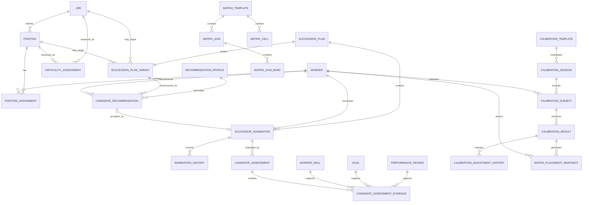
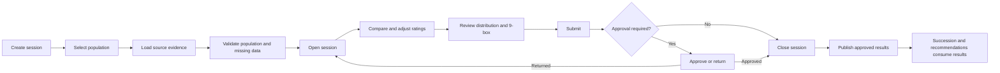
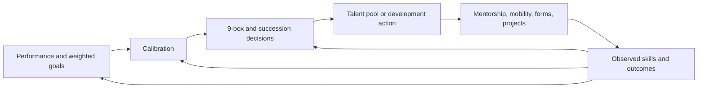

# Dynamics 365 Human Resources Succession Management

## Functional and Engineering Requirements

| Document attribute | Value |
| --- | --- |
| Product | Dynamics 365 Human Resources |
| Capability | Succession Management, Talent Calibration, and 9-Box Matrix |
| Release | Version 1 / MVP |
| Status | Requirements baseline for product, design, and engineering |
| Date | 21 September 2026 |
| Primary system of record | Dynamics 365 Human Resources / Finance and Operations |

---

## 1. Purpose

This document defines the complete Version 1 requirements for introducing succession management into Dynamics 365 Human Resources.

The solution must enable an organization to:

1. Identify critical jobs and positions.
2. Create succession plans against a specific position or a reusable job/role.
3. Manually nominate and rank multiple internal workers.
4. Assess successor readiness using configurable rating scales.
5. Use existing Dynamics HR performance reviews, weighted goals, skills, competencies, qualifications, and experience as candidate evidence.
6. Calibrate performance and potential ratings through controlled review sessions.
7. Plot approved talent assessments on a configurable 9-box matrix.
8. Generate explainable candidate recommendations after the manual process is operational.
9. Approve, monitor, audit, and report succession decisions.

The document is intentionally self-contained so that product managers, functional consultants, UX designers, architects, developers, testers, reporting teams, and implementation partners can understand the required behavior without relying on prior discussions.

---

## 2. Version 1 Scope

### 2.1 Included

- Position-based succession planning.
- Job/role-based succession planning.
- Multiple successor nominations per target.
- Manual worker nomination.
- Configurable readiness, criticality, performance, potential, role-fit, and risk scales.
- Critical job and critical position designation.
- Candidate ranking and readiness assessment.
- Candidate evidence from completed performance reviews.
- Candidate evidence from weighted performance goals.
- Candidate evidence from skills and competencies.
- Candidate evidence from education, certificates, tests, and professional experience.
- Candidate comparison.
- Performance and potential calibration.
- Configurable distribution guidelines.
- Configurable 9-box matrix.
- Automatic, explainable candidate recommendations.
- Plan and nomination workflows.
- Security, confidentiality, history, and auditing.
- Notifications and review reminders.
- Coverage, readiness, calibration, and 9-box reporting.
- DMF/OData integration and selected Dataverse exposure.

### 2.2 Excluded from Version 1

- Talent pools and pool membership.
- External successor candidates.
- Employee self-nomination.
- Predictive attrition or machine-learning ranking.
- Automatic approval of a recommended candidate.
- Automatic creation of an approved nomination.
- Replacement charts independent of positions or jobs.
- Compensation decisions inside the succession module.
- Forced termination or performance actions based on calibration or 9-box placement.

Talent pools can be introduced in Version 2 without redesigning the core model. A future pool member can point to the same Worker, Candidate Assessment, Readiness Level, and Development Plan concepts defined in this document.

---

## 3. Terminology

| Term | Definition |
| --- | --- |
| Worker | An existing employee or contractor represented by the Dynamics HR Worker record. |
| Job/Role | A Dynamics HR Job. “Role” in the business experience maps to Job in the data model. |
| Position | A specific authorized position in the organization, normally occupied by one worker at a time. |
| Succession target | The Position or Job for which continuity is being planned. |
| Incumbent | The worker currently assigned to the target Position. A Job-level plan can have multiple incumbents and does not require one incumbent. |
| Succession plan | The governed, effective-dated record containing the target, ownership, nominees, status, review cycle, and approvals. |
| Successor nomination | A worker proposed for a succession target. |
| Readiness | The estimated time or state indicating when a nominee can perform the target role. |
| Criticality | The importance and replacement difficulty of a Job or Position. |
| Candidate assessment | A period-specific record containing evidence and calculated or manually entered assessment results. |
| Calibration | A governed process in which authorized participants compare and adjust ratings consistently across a defined worker population. |
| 9-box matrix | A configurable matrix that normally plots performance on the horizontal axis and potential on the vertical axis. |
| Recommendation | A system-generated, explainable candidate suggestion. It is not a nomination until a planner accepts it. |
| Coverage | Whether a succession target has enough approved nominees at the required readiness levels. |

---

## 4. Product Principles

1. **Reuse Dynamics HR master data.** Worker, Employment, Job, Position, Position Assignment, Rating Model, Skill, Goal, Performance Review, Education, Certificate, and Experience remain the authoritative sources.
2. **Do not place a permanent talent label on Worker.** Readiness, potential, calibrated ratings, and matrix placement are contextual and effective-dated.
3. **Separate source, proposed, calibrated, and approved values.** Calibration must never silently overwrite a completed performance review.
4. **Make recommendations explainable.** Every score must show its source, weight, age, missing evidence, and exclusion reasons.
5. **Require human decisions.** Automatic matching produces recommendations; authorized users create and approve nominations.
6. **Preserve history.** Approved plans, ratings, placements, and nominations are archived or superseded, not deleted.
7. **Use configuration rather than hard coding.** Rating scales, weights, thresholds, distribution guidelines, nomination limits, and review cycles must be configurable.
8. **Apply least-privilege security.** Succession information is confidential and must not appear in ordinary employee self-service.
9. **Make the dedicated workspace authoritative.** Position, Job, Worker, and organization hierarchy pages provide contextual entry points into the same records.
10. **Treat 9-box as a view of assessment results.** A matrix cell is not an independent worker attribute.

---

## 5. Dynamics HR Reuse Strategy

### 5.1 Existing Entities to Reuse

| Dynamics HR capability/entity | Succession use |
| --- | --- |
| Worker | Candidate identity and worker status. |
| Employment V2 | Legal entity, employment dates, status, and worker eligibility. |
| Positions V2 | Position-based target and critical-position attributes. |
| Position worker assignments V2 | Current incumbent and assignment history. |
| Position hierarchies | Organization scope, manager access, and org-chart navigation. |
| Jobs and Job detail | Job/role target and common eligibility requirements. |
| Job family, job function, job type | Search filters and recommendation features. |
| Job skills and Skill mapping | Required skill definitions. |
| Skills and Skill competency | Worker capability evidence and proficiency. |
| Rating models and Rating levels | Shared scale foundation, extended with succession purposes. |
| Performance reviews/Discussions | Completed performance rating and competency evidence. |
| Review competencies | Competency assessment evidence. |
| Goals and Review goals | Goal achievement evidence. |
| Goal measurements | Quantitative goal achievement evidence. |
| Weighted goals enhancement | Weighted goal score used by candidate assessment and calibration. |
| Performance journals | Optional supporting evidence, not an automatic score in V1. |
| Education, certificates, tests, professional experience | Mandatory qualification checks and role-fit evidence. |
| Courses and course competencies | Development recommendations and future development-plan links. |
| Workflow framework | Plan, nomination, and calibration approval workflows. |
| Business events and batch framework | Notifications, review reminders, and integrations. |
| Organization hierarchy and legal entity security | Data access boundaries. |

### 5.2 Existing Entities to Extend

| Entity | Required extension |
| --- | --- |
| Position | Succession enabled, critical flag, criticality rating, risks, required coverage, owner, review date, and inheritance state. |
| Job | Equivalent critical-role fields and default values inherited by Positions. |
| Rating Model | Rating purpose and effective-dated version metadata. |
| Rating Level | Normalized score, display order, color, active dates, and matrix band mapping support. |
| Performance Review | Read-only relation to candidate assessment/calibration source; no calibrated value should overwrite the review. |
| Goal/Review Goal | Ensure weight, achieved score, target, actual, status, and review-period context are exposed to succession assessment. |
| Worker page | Read-only secured succession summary and navigation, without storing succession state on Worker. |

### 5.3 New Entities

| Entity | Purpose |
| --- | --- |
| Succession Management Parameters | Global/company defaults and feature behavior. |
| Criticality Assessment | Effective-dated justification and scoring for Job or Position criticality. |
| Succession Plan | Governed plan header. |
| Succession Plan Target | Position or Job selected as the plan target. |
| Successor Nomination | Worker nomination, readiness, rank, status, and rationale. |
| Nomination History | Immutable history of significant nomination changes. |
| Succession Plan Review | Periodic plan health review. |
| Candidate Assessment | Evidence snapshot and normalized assessment scores. |
| Candidate Assessment Evidence | Trace from each score to its source record. |
| Recommendation Profile | Eligibility rules, weights, and thresholds. |
| Candidate Recommendation | Explainable recommendation result. |
| Calibration Template | Reusable definition of dimensions, population, views, and controls. |
| Calibration Session | A governed calibration event. |
| Calibration Participant | Facilitator, reviewer, contributor, or observer. |
| Calibration Subject | Worker included in a session. |
| Calibration Result | Source, proposed, calibrated, and approved rating values. |
| Calibration Adjustment History | Full audit of each rating movement. |
| Distribution Guideline | Numerical or percentage targets for a rating dimension. |
| Distribution Guideline Band | Target/minimum/maximum for a rating level. |
| Matrix Template | Reusable n-box definition. |
| Matrix Axis | Horizontal or vertical assessment dimension. |
| Matrix Axis Band | Low/medium/high or another configured band. |
| Matrix Cell | Cell label, color, description, and recommended actions. |
| Matrix Placement Snapshot | Approved period-specific worker placement. |
| Matrix Movement History | Movement between approved placements over time. |
| Succession Comment | Confidential comments with visibility classification. |
| Succession Placement Outcome | Records selection and actual placement. |

---

## 6. Relationship Model

### 6.1 Relationship Rules

- A Succession Plan has exactly one Succession Plan Target.
- A Succession Plan Target references either one Position or one Job, never both.
- A Position target captures the current incumbent as a snapshot but remains valid after the incumbent changes.
- A Job target does not require one incumbent because multiple workers can hold Positions associated with the Job.
- A Worker can be nominated for multiple targets.
- A Worker can appear only once as an active nomination in the same plan.
- A Candidate Assessment can support a nomination, recommendation, calibration subject, or all three.
- A Calibration Result can be used as evidence in Candidate Assessment without changing the original Performance Review.
- A Matrix Placement Snapshot references the approved assessment/calibration results that produced it.
- A Recommendation can be accepted into a Draft Nomination; it cannot directly create an Approved Nomination.

---

## 7. Personas and Responsibilities

| Persona | Responsibilities |
| --- | --- |
| Succession Administrator | Configure scales, parameters, templates, permissions, reason codes, and defaults. |
| HR Business Partner | Assess criticality, create plans, nominate candidates, facilitate calibration, and monitor coverage. |
| Succession Planner | Maintain authorized plans, candidates, ranking, readiness, and evidence. |
| Manager | Propose candidates and contribute evidence within the permitted hierarchy. |
| Calibration Facilitator | Create sessions, control discussions, manage changes, and submit results. |
| Executive Approver | Review critical plans, approve nominations, and approve calibration outcomes. |
| Talent Reviewer | Compare candidates and contribute comments without owning the plan. |
| Auditor | Read plans, approvals, adjustment history, and configuration versions. |
| Reporting Consumer | View secured aggregate dashboards without accessing restricted comments. |

---

## 8. Configuration Requirements

### 8.1 Succession Management Parameters

Create a parameters page under **Human resources > Setup > Succession management > Parameters**.

Required settings:

- Succession plan number sequence.
- Default target type.
- Default plan review frequency.
- Default criticality scale.
- Default readiness scale.
- Default performance scale.
- Default potential scale.
- Default matrix template.
- Default calibration template.
- Default recommendation profile.
- Maximum active nominations per plan.
- Maximum active nominations per worker.
- Allow tied ranking: Yes/No.
- Require candidate interest: Yes/No.
- Require approval for plans: Yes/No.
- Require approval for nominations: Yes/No.
- Require approval for calibration results: Yes/No.
- Allow position to override Job criticality: Yes/No.
- Completed review lookback periods.
- Evidence stale-after interval.
- Recommendation expiry interval.
- Coverage definition.
- Ready-now levels included in ready-now coverage.
- Confidentiality default.
- Notification lead times.

### 8.2 Rating Models and Levels

Extend the existing Dynamics HR Rating Model rather than creating unrelated succession-only scales.

Add `RatingPurpose` values:

- Performance.
- Potential.
- Readiness.
- Criticality.
- Role Fit.
- Risk of Loss.
- Impact of Loss.

Each Rating Level requires:

- Code and localized label.
- Description.
- Display order.
- Normalized score from 0 through 100.
- Color.
- Effective start and end dates.
- Active state.
- Whether it counts as ready-now.
- Optional minimum and maximum numeric source values.

Once referenced by an approved transaction, a scale version cannot be structurally changed. Administrators must create a new effective-dated version.

### 8.3 Default Readiness Scale

| Level | Normalized value | Ready-now coverage |
| --- | ---: | --- |
| Ready now | 100 | Yes |
| Ready in less than 1 year | 80 | Optional by policy |
| Ready in 1–2 years | 60 | No |
| Ready in 3–5 years | 30 | No |
| Not ready/Not assessed | 0 | No |

### 8.4 Reason Codes

Configure reason codes by action:

- Mark critical/non-critical.
- Position-level criticality override.
- Nominate.
- Change readiness.
- Change rank.
- Reject.
- Withdraw.
- Remove.
- Override recommendation.
- Override calculated evidence.
- Adjust rating during calibration.
- Reopen plan/session.
- Archive plan.

A reason can be configured as mandatory, optional, active, effective-dated, and restricted to selected actions.

---

## 9. Critical Job and Position Design

### 9.1 Job-Level Configuration

Add a **Succession** FastTab to the Job page containing:

- Succession enabled.
- Critical role flag.
- Criticality rating.
- Criticality reason.
- Business impact.
- Vacancy risk.
- Talent scarcity.
- Knowledge-loss risk.
- Typical time to fill.
- Emergency coverage required.
- Minimum approved successors.
- Minimum ready-now successors.
- Default succession owner role/person.
- Default review frequency.
- Last assessed by/date.
- Next review date.

Job values act as defaults for Positions created from or associated with that Job.

### 9.2 Position-Level Configuration

Add a **Succession** FastTab and FactBox to the Position page.

The Position must support:

- Inherit succession settings from Job.
- Override succession settings where permitted.
- Display inherited versus overridden values clearly.
- Identify the current incumbent from Position Worker Assignment.
- Create or open the active succession plan.
- Display plan status, total successors, ready-now successors, and next review date.

### 9.3 Criticality Assessment

Criticality must be more than a Boolean field. Create an effective-dated Criticality Assessment containing:

- Target type and target reference.
- Rating model and level.
- Business impact score.
- Vacancy probability/risk score.
- Talent scarcity score.
- Knowledge concentration score.
- Time-to-productivity score.
- Regulatory or operational dependency.
- Overall calculated score.
- Final rating.
- Manual override and reason.
- Assessor and assessment date.
- Approval status.
- Expiry/next review date.

The Position/Job `IsCritical` field is the current derived summary used for filtering. The Criticality Assessment retains the governed history.

---

## 10. Succession Plan Design

### 10.1 Plan Header

Required fields:

- Plan ID.
- Plan name.
- Description.
- Legal entity.
- Plan owner.
- HR business partner.
- Plan status.
- Effective start/end dates.
- Review frequency.
- Last review date.
- Next review date.
- Confidentiality level.
- Required successor count.
- Required ready-now successor count.
- Workflow status.
- Created by/date and modified by/date.

Statuses:

- Draft.
- In Review.
- Approved.
- Active.
- On Hold.
- Closed.
- Archived.

### 10.2 Target Selection

The creation wizard asks the planner to choose:

1. **Position:** use when succession is needed for a particular seat, incumbent, location, or reporting relationship.
2. **Job/Role:** use when successors should be assessed for a reusable role shared by multiple positions.

For Position targets, show:

- Position ID/title.
- Job.
- Department.
- Reports-to position.
- Current incumbent.
- Incumbent tenure.
- Criticality and current coverage.

For Job targets, show:

- Job ID/title.
- Job family and function.
- Number of active Positions.
- Number of incumbents.
- Required qualifications and skills.
- Criticality and current coverage.

### 10.3 Plan Validations

- Exactly one target is required.
- The target must be succession-enabled.
- Plan owner and review date are required before activation.
- Overlapping active plans for the same target are blocked unless the parameter permits them.
- The incumbent cannot be an active successor to their own Position.
- A closed or archived target Position cannot receive a new active plan.
- An approved plan cannot be deleted.

---

## 11. Manual Nomination Design

### 11.1 Nomination Entry

The **Nominate successor** action opens a dialog with:

- Worker search.
- Current job and position.
- Department and manager.
- Nomination source.
- Readiness level.
- Estimated ready date.
- Rank.
- Emergency successor flag.
- Candidate interest.
- Nomination rationale.
- Strengths.
- Concerns.
- Effective start date.
- Optional assessment refresh.

### 11.2 Worker Eligibility

The search excludes by default:

- Terminated workers.
- Workers whose employment ends before the plan effective date.
- The incumbent of the target Position.
- An existing active nominee in the same plan.
- Workers failing a mandatory legal or qualification requirement.

The search can filter by:

- Legal entity.
- Organization hierarchy.
- Department.
- Manager.
- Job, job family, function, or level.
- Location.
- Length of service.
- Performance level.
- Potential level.
- Skill and proficiency.
- Goal score.
- Qualification.
- Readiness.

### 11.3 Nomination Status

Recommended lifecycle:

`Draft -> Proposed -> Under Review -> Approved -> Ready -> Selected -> Placed`

Alternative terminal states:

- Rejected.
- Withdrawn.
- Archived.

State-transition validations:

- Draft requires worker and plan.
- Proposed requires rationale and readiness.
- Approved requires current evidence or an approved stale-evidence override.
- Ready requires an allowed readiness level.
- Selected requires approved plan and nomination.
- Placed requires a confirmed worker action or placement record.

### 11.4 Ranking

- Ranking is ordinal within a plan.
- Rank 1 is the preferred candidate.
- Unique ranks are the default.
- Ties are supported only if enabled in parameters.
- Ranking can be disabled for plans that use readiness-only slates.
- A rank change after submission requires a reason.
- Approved-rank changes create a new history record and may restart workflow.
- Emergency successor ranking can be separate from long-term ranking if enabled.

---

## 12. Candidate Evidence and Weighted Goals

### 12.1 Evidence Priority

Use evidence in this order:

1. Approved calibration result for the relevant period.
2. Latest completed performance review.
3. Historical completed performance reviews.
4. Weighted goal result for the relevant period.
5. Review competencies.
6. Worker skill proficiency and required Job skills.
7. Education, certificates, tests, and professional experience.
8. Authorized manual assessment with reason.

### 12.2 Weighted Goal Reuse

The enhanced weighted-goal capability is reused directly; succession must not create a second goal-weight implementation.

For each goal $i$:

- $w_i$ is the configured goal weight.
- $a_i$ is normalized achievement from 0 to 100.
- Included goal weights must be validated according to the Performance configuration, normally totaling 100%.

The weighted goal score is:

$$
G = \frac{\sum_i w_i a_i}{\sum_i w_i}
$$

Requirements:

- Read goals belonging to the selected assessment/review period.
- Include only goal statuses configured as scoreable.
- Preserve each goal’s weight, achievement, source rating, and status in evidence details.
- Show excluded goals and exclusion reasons.
- Display whether the score is final or provisional.
- Never recalculate a finalized historical goal result using later goal changes.
- Store a snapshot when a nomination, recommendation, calibration result, or plan is approved.
- Allow the recommendation profile to configure the contribution of weighted goals to Role Fit.
- Allow calibration participants to view weighted-goal evidence but not edit the goal from the calibration page.

### 12.3 Skills and Qualifications

Skill-fit must consider both coverage and proficiency.

For each required skill:

- Required proficiency.
- Worker proficiency.
- Whether the skill is mandatory.
- Evidence source and date.
- Certification or expiry status where applicable.

A mandatory missing skill can either disqualify the candidate or apply a configured penalty. The behavior is set in the Recommendation Profile.

### 12.4 Candidate Assessment

Store:

- Worker and target.
- Assessment period and as-of date.
- Performance source and normalized score.
- Potential source and normalized score.
- Weighted goal score.
- Skill-fit score.
- Experience score.
- Qualification score.
- Readiness.
- Missing-data indicators.
- Stale-evidence indicators.
- Overall Role Fit.
- Calculated versus overridden values.
- Override reason and approver.

---

## 13. Calibration Design

### 13.1 Purpose

Calibration allows HR and leaders to compare workers across teams and apply consistent performance and potential standards. Calibration results supplement source reviews; they do not modify or erase those reviews.

### 13.2 Calibration Template

Configure:

- Template name and effective dates.
- Performance and/or potential dimensions.
- Source rating model for each dimension.
- Output rating model for each dimension.
- Population selection rules.
- Required participant roles.
- List, distribution, and matrix views.
- Whether participants can adjust values.
- Mandatory change reason.
- Distribution guideline.
- Workflow and approval requirements.
- Minimum cohort size.
- Visibility of comments and sensitive data.
- Whether approved results are available to succession and recommendations.

### 13.3 Calibration Session Workflow

Statuses:

- Draft.
- Population Prepared.
- In Progress.
- Submitted.
- Returned.
- Approved.
- Closed.
- Cancelled.

### 13.4 Calibration Population

Population can be selected by:

- Legal entity.
- Organization hierarchy.
- Manager hierarchy.
- Department.
- Position or Job.
- Job family/function/level.
- Performance period.
- Critical-position incumbent.
- Existing active successor nomination.

Store the selected population as session subjects so later organization changes do not silently change an open session.

### 13.5 Rating Values

For each subject and dimension store:

- Source rating and source record.
- Normalized source score.
- Proposed rating.
- Current calibrated rating.
- Approved rating.
- Adjustment reason.
- Adjustment comment.
- Changed by/date.

The UI must display source and calibrated values side by side.

### 13.6 Distribution Guidelines

Support:

- Percentage targets.
- Numeric targets.
- Minimum/maximum ranges.
- Separate guidelines by dimension and optionally organization level.

For Version 1, distribution guidelines generate warnings and variances. They do not force a user to move a worker or prevent approval unless the template explicitly configures variance approval.

Show:

- Target count/percentage.
- Current count/percentage.
- Difference.
- Before-calibration distribution.
- Current distribution.
- Approved distribution.

### 13.7 Calibration Audit

Every change must retain:

- Session.
- Worker.
- Dimension.
- Old and new value.
- User and timestamp.
- Reason code and comment.
- View from which the change was made.
- Whether the change was subsequently approved or reversed.

Approved sessions are immutable. Reopening creates a new revision and requires authorization and a reason.

---

## 14. Nine-Box Matrix Design

### 14.1 Configuration

Create a configurable Matrix Template. The default template is 3×3:

- Horizontal axis: Performance.
- Vertical axis: Potential.
- Bands: Low, Medium, High.

Each cell contains:

- Code.
- Localized label.
- Description.
- Color.
- Display order.
- Talent interpretation.
- Recommended action.
- Suggested development focus.
- Whether candidates in the cell meet a recommendation threshold.

Avoid labels such as “bad hire” in the product default. Use neutral, action-oriented terminology.

### 14.2 Default Cells

| Potential / Performance | Low | Medium | High |
| --- | --- | --- | --- |
| High | Emerging potential | Growth candidate | Future leader |
| Medium | Development priority | Core contributor | High-impact contributor |
| Low | Performance support | Experienced specialist | Trusted expert |

Organizations can rename all cells.

### 14.3 Placement Logic

- Map normalized performance to a horizontal band.
- Map normalized potential to a vertical band.
- The intersection determines the calculated cell.
- Placement is generated from approved calibration results when available.
- Without calibration, an authorized user can generate a provisional placement from completed review/assessment data.
- Provisional and approved placements must be visibly different.
- Approved placements become immutable snapshots.

### 14.4 Interaction

The matrix must support:

- Worker cards inside cells.
- Search and filtering.
- Counts and percentages by cell.
- Source-rating display.
- Worker quick view.
- Candidate evidence panel.
- Existing succession nomination indicators.
- “Nominate as successor” action.
- Historical placement and movement.
- Export subject to security.

Drag-and-drop movement is allowed only in an open calibration session. The movement changes the relevant calibrated dimension value, requires a reason, and writes adjustment history. Dragging a card must not merely alter a visual cell without changing the underlying calibrated result.

### 14.5 Reuse

The same Matrix Template, Axis, Band, Cell, and Placement entities must be reusable by:

- Calibration sessions.
- Succession candidate discovery.
- Secured talent-review dashboards.
- Historical movement reporting.

Do not create a separate 9-box implementation inside Succession Plan.

---

## 15. Automatic Candidate Recommendations

### 15.1 Recommendation Profile

Configure profiles by target type or organization. Each profile contains:

- Eligibility filters.
- Mandatory requirements.
- Evidence lookback periods.
- Stale-data policy.
- Component weights.
- Minimum overall score.
- Minimum performance/potential/readiness.
- Missing-data behavior.
- Maximum returned candidates.
- Whether approved calibration is required or preferred.
- Whether 9-box cell is a filter, score contributor, or display-only evidence.

### 15.2 Default Role-Fit Formula

$$
R = 0.25P + 0.20U + 0.30S + 0.10G + 0.10E + 0.05Q
$$

Where:

- $P$ = performance score.
- $U$ = potential score.
- $S$ = skills and competency fit.
- $G$ = weighted goal achievement.
- $E$ = relevant experience.
- $Q$ = education, certificate, and test qualification fit.

All weights are configurable and must total 100%.

### 15.3 Recommendation Workflow

1. Planner selects **Find candidates** from a succession plan.
2. System selects the applicable Recommendation Profile.
3. Planner reviews or narrows permitted filters.
4. System evaluates eligibility and mandatory exclusions.
5. System calculates normalized component scores.
6. System stores a recommendation run and evidence snapshot.
7. UI displays ranked candidates with score breakdown and missing evidence.
8. Planner selects one or more candidates.
9. System creates Draft nominations and records source as Recommendation.
10. Normal nomination review and approval follows.

### 15.4 Fairness and Controls

- Protected characteristics must not be used in eligibility or scoring.
- The score must be reproducible from stored evidence and configuration version.
- Missing evidence must be visible.
- Manual overrides require reasons.
- Recommendation expiry must be visible.
- A rejected recommendation remains in run history but does not become a nomination.
- Model/profile changes do not rewrite prior runs.

---

## 16. End-to-End Workflows

### 16.1 Critical Position to Approved Plan

1. HRBP opens Job or Position.
2. HRBP completes Criticality Assessment.
3. Workflow approves criticality when configured.
4. Current critical flag and rating are updated.
5. HRBP selects **Create succession plan**.
6. Wizard creates plan and target.
7. Planner manually nominates workers or requests recommendations.
8. Candidate evidence is loaded and snapshotted.
9. Planner assigns readiness and ranking.
10. Plan enters review workflow.
11. Approver approves, rejects, or returns the plan.
12. Approved plan becomes active and contributes to coverage reporting.
13. Owner receives periodic review notifications.

### 16.2 Performance to Calibration to Succession

1. Performance review and weighted goals are finalized.
2. HR creates a Calibration Session from a template.
3. System loads source performance, goals, competencies, and optional potential assessments.
4. Participants compare subjects in list, distribution, and 9-box views.
5. Authorized participants adjust ratings with reasons.
6. Session is submitted and approved.
7. Approved calibration results are published.
8. Candidate Assessment uses approved calibrated results as the preferred evidence.
9. Recommendations are regenerated or marked stale.
10. Planner reviews candidates and creates/updates nominations.

### 16.3 Successor Placement

1. An approved nominee is selected.
2. Planner records target and expected placement date.
3. Existing Dynamics HR worker/position action performs the actual assignment or promotion.
4. Succession Placement Outcome references the resulting action.
5. Nomination status becomes Placed.
6. Plan coverage and incumbent information are recalculated.
7. Plan is reviewed, closed, or retained for future coverage.

### 16.4 Scheduled Review

1. Batch job finds plans approaching the next review date.
2. Owner and HRBP receive notification.
3. System identifies inactive workers, changed assignments, expired evidence, and stale recommendations.
4. Reviewer confirms, updates, replaces, or archives nominations.
5. Ranking/readiness changes are recorded in history.
6. Review outcome and next review date are saved.
7. Material changes optionally restart approval workflow.

---

## 17. Workflow Requirements

### 17.1 Criticality Workflow

Configurable steps:

- Submit by HRBP or manager.
- Review by HR leadership.
- Approve by designated authority.
- Return with comments.
- Apply approved current criticality.

### 17.2 Succession Plan Workflow

Workflow conditions can use:

- Criticality level.
- Target type.
- Legal entity.
- Organization level.
- Confidentiality.
- Ready-now coverage.
- Number of nominations.

Actions:

- Submit.
- Approve.
- Reject.
- Return for change.
- Delegate.
- Recall before approval.

### 17.3 Nomination Workflow

Support plan-level approval, nomination-level approval, or both. The organization selects one approach in parameters.

Material changes after approval include:

- Worker replacement.
- Readiness change.
- Rank change.
- Candidate interest changed to Not Interested.
- Mandatory qualification no longer met.

The workflow configuration determines whether a material change immediately restarts approval or marks the nomination `Approval required`.

### 17.4 Calibration Workflow

- Facilitator prepares and opens session.
- Participants calibrate.
- Facilitator submits.
- Approver approves or returns.
- Approved results are locked and published.
- Reopen requires a secured action and reason.

---

## 18. User Experience and Placement

### 18.1 Succession Management Workspace

This is the primary work surface. It should prioritize repeated operational work over decorative presentation.

Workspace sections:

- **My actions:** overdue plans, returned workflows, expired evidence, and uncovered critical targets.
- **Critical targets:** Position/Job, criticality, incumbent, coverage, ready-now count, owner, next review.
- **Plans:** status, workflow, target, owner, and effective dates.
- **Candidates:** nominations, readiness, rank, evidence freshness, and conflicts.
- **Calibration:** sessions awaiting preparation, participation, submission, or approval.
- **9-box:** recent approved matrices and current sessions.
- **Analytics:** coverage and readiness summary with links to filtered lists.

Efficiency requirements:

- Saved views and filters.
- Bulk selection for review reminders and evidence refresh.
- Inline status indicators.
- Keyboard-accessible grid actions.
- Side panes for quick review without losing list context.
- Deep links preserving filters.
- No duplicate data-entry screens for the same record.

### 18.2 Position Page

Add:

- Succession FastTab for configuration.
- Succession FactBox for current plan summary.
- Create/Open Plan action.
- Nominate Successor action when an active plan exists.
- Coverage warning when critical and under-covered.

This page serves users already managing a Position. It must not duplicate the full workspace.

### 18.3 Job Page

Add the same contextual capabilities for Job-level planning, plus a summary of Positions and incumbents using that Job.

### 18.4 Worker Page

Add a secured **Succession** FactBox showing:

- Active nominations.
- Target, rank, readiness, and status.
- Latest approved performance/potential evidence.
- Development actions when available.

Access must be limited to authorized HR and planners. Employees must not see confidential nominations by default.

### 18.5 Organization Hierarchy/Org Chart

Add indicators:

- Critical target.
- No active plan.
- Under-covered.
- Covered.
- Ready-now covered.
- Plan due for review.

Selecting an indicator opens a side pane with summary and a link to the plan. Full editing remains in the Succession workspace for V1 to reduce complexity and preserve consistent workflow behavior.

### 18.6 Performance Review

Add a read-only indicator showing whether the completed review is used by an active Candidate Assessment or Calibration Session. Users navigate to the secured target record only if authorized.

### 18.7 Goals

Display the configured goal weight and weighted contribution consistently in Performance and Succession evidence. Succession must consume, not redefine, this calculation.

### 18.8 Calibration Workspace/Page

Use a dense work-focused layout:

- Subject list and filters on the left/main grid.
- Evidence side pane.
- Distribution and 9-box tabs.
- Persistent session status and variance summary.
- Clearly differentiated source and calibrated values.
- Undo permitted before submission, with history retained.

---

## 19. Feature Overlap and Reuse Matrix

| Shared capability | Performance | Calibration | 9-box | Succession | Recommendations |
| --- | --- | --- | --- | --- | --- |
| Rating Model/Level | Source | Source/output | Axis bands | Readiness/criticality | Normalization |
| Weighted goals | Calculates | Evidence | Detail view | Candidate evidence | Goal component |
| Performance review | Owns source rating | Source evidence | Placement source | Candidate evidence | Performance component |
| Skills/competencies | Review evidence | Supporting evidence | Worker detail | Gap comparison | Skill-fit component |
| Job requirements | Reference | Filter | Filter | Target requirements | Eligibility/fit |
| Candidate Assessment | Not owned | May produce/update | Placement input | Nomination evidence | Scoring input |
| Calibration Result | N/A | Owns | Preferred input | Preferred evidence | Preferred input |
| Matrix Template | N/A | View configuration | Owns definition | Candidate discovery | Optional filter |
| Worker | Review subject | Session subject | Display subject | Nominee | Recommended candidate |
| Position/Job | Review context | Population filter | Filter | Plan target | Recommendation target |
| Workflow | Review workflow | Session approval | Uses calibration approval | Plan/nomination approval | No approval itself |
| Audit history | Review history | Adjustment history | Placement history | Nomination history | Run history |

### 19.1 Explicit Non-Duplication Rules

- Weighted goal calculations remain owned by Performance Management.
- Performance Review remains the source record; calibration does not overwrite it.
- Rating Model and Rating Level are shared and extended, not copied.
- Matrix placements are generated from assessment/calibration results, not manually maintained on Worker.
- Readiness is stored on the nomination because one worker can have different readiness for different targets.
- Criticality is stored through assessment history with a current summary on Job/Position.
- Candidate Recommendations and Successor Nominations are separate because recommendations are system suggestions and nominations are governed human decisions.
- Position assignment remains owned by Personnel Management. Succession records only reference the resulting placement action.

---

## 20. Security and Privacy

### 20.1 Duties and Privileges

Create duties for:

- Maintain succession configuration.
- Assess critical Jobs and Positions.
- Maintain succession plans.
- Maintain nominations.
- View candidate evidence.
- Facilitate calibration.
- Participate in calibration.
- Approve calibration.
- Approve succession plans/nominations.
- View succession analytics.
- Audit succession history.

### 20.2 Record-Level Security

Apply access by:

- Legal entity.
- Organization hierarchy.
- Plan owner/participant.
- Position responsibility.
- Calibration participant assignment.
- Confidentiality level.

### 20.3 Sensitive Data

- Succession status, potential, readiness, risk, and 9-box placement are confidential talent data.
- Do not expose these values through standard employee self-service.
- Restrict export based on privilege.
- Mask sensitive comments for reporting-only users.
- Do not include protected characteristics in recommendation scoring.
- Diversity reporting must be aggregate, secured, and subject to minimum population thresholds.

---

## 21. Notifications and Alerts

Create in-app notifications and optional email/Teams delivery for:

- Critical target has no active plan.
- Coverage is below requirement.
- No ready-now candidate exists.
- Plan review is due or overdue.
- Criticality assessment expires.
- Candidate evidence is stale.
- Nominee employment ends or becomes inactive.
- Incumbent changes or departs.
- Worker is nominated beyond configured limit.
- Workflow is assigned, returned, approved, or rejected.
- Calibration session is ready, due, submitted, returned, or approved.
- Recommendation run expires or becomes stale.

Notifications must link directly to the relevant secured record.

---

## 22. Reporting Requirements

### 22.1 Succession Metrics

$$
\text{Plan Coverage Rate} =
\frac{\text{Critical targets with an active approved plan}}
{\text{Active critical targets}}
$$

$$
\text{Successor Coverage Rate} =
\frac{\text{Critical targets meeting required approved successor count}}
{\text{Active critical targets}}
$$

$$
\text{Ready-Now Coverage Rate} =
\frac{\text{Critical targets meeting ready-now requirement}}
{\text{Active critical targets}}
$$

Required reports:

- Critical Jobs and Positions.
- Critical targets without plans.
- Under-covered targets.
- Ready-now coverage.
- Successors by target.
- Multiple nominations by worker.
- Readiness distribution.
- Plans due for review.
- Stale candidate evidence.
- Nomination changes and approvals.
- Internal placement outcomes.

### 22.2 Calibration Reports

- Source versus calibrated rating distribution.
- Actual versus guideline variance.
- Rating changes by organization and reviewer.
- Adjustments by reason.
- Sessions by status.
- Missing-source-data subjects.

### 22.3 Nine-Box Reports

- Current placement distribution.
- Placement by organization, Job, level, or criticality.
- Movement between periods.
- Successor coverage by matrix cell.
- Nomination conversion by matrix cell.

Reports must respect the same row-level security as transactions.

---

## 23. Integration Requirements

### 23.1 DMF/OData

Provide entities for:

- Succession parameters where safe for migration.
- Criticality assessments.
- Succession plans.
- Plan targets.
- Successor nominations.
- Nomination history as read-only export.
- Plan reviews.
- Candidate assessments and evidence.
- Calibration templates and sessions.
- Calibration subjects and results.
- Distribution guidelines.
- Matrix templates, cells, and placements.
- Recommendation profiles and results.
- Placement outcomes.

Import entities require stable alternate keys and idempotent behavior.

### 23.2 Dataverse

Expose records needed for Power Apps, Power Automate, Power BI, and Teams scenarios. Finance and Operations remains authoritative for transactional state.

Recommended Dataverse projection:

- Current critical Job/Position summary.
- Succession plan and target.
- Current nomination summary.
- Current approved candidate assessment.
- Calibration session and approved result summary.
- Matrix placement snapshot.
- Workflow/action status.

Do not create a separate Dataverse-only succession master.

### 23.3 Business Events

Publish:

- Critical target approved.
- Plan submitted/approved/returned.
- Nomination submitted/approved/rejected/withdrawn.
- Plan review due.
- Calibration session opened/submitted/approved/closed.
- Approved calibration result published.
- Successor selected/placed.
- Coverage dropped below requirement.

---

## 24. Nonfunctional Requirements

### 24.1 Performance

- Workspace lists must use server-side filtering and paging.
- Candidate search must not load the entire workforce into the client.
- Recommendation calculations run asynchronously for large populations.
- Calibration sessions store a population snapshot to provide stable performance.
- 9-box rendering must support large cohorts through aggregation, filtering, and progressive card loading.

### 24.2 Auditability

- Store configuration version used by each approved calculation.
- Store source record IDs and as-of dates.
- Store before/after values for every governed change.
- Use database audit where appropriate in addition to domain history entities.

### 24.3 Accessibility and Localization

- All labels, cell names, scale levels, and reason descriptions must be localizable.
- Color cannot be the only status or matrix-cell indicator.
- Keyboard navigation must cover grids, filters, dialogs, and matrix cards.
- Screen-reader labels must identify current rating, proposed rating, and calibrated rating distinctly.

### 24.4 Reliability

- Recommendation and snapshot generation must be restartable and idempotent.
- Failed batch runs must not leave partially approved data.
- Approval publication must be transactional.
- Historical snapshots remain readable when source configuration is retired.

---

## 25. Logical Engineering Delivery Plan

### Epic 1: Shared Configuration

1. Add feature-management flags.
2. Create Succession Management Parameters.
3. Extend Rating Model with Rating Purpose.
4. Extend Rating Level with normalized score, order, color, dates, and ready-now flag.
5. Add effective-dated scale version validation.
6. Create succession reason-code configuration.
7. Configure nomination and plan statuses.
8. Create duties, privileges, and initial security roles.
9. Add number sequences.
10. Add configuration data entities.

**Exit:** Administrators can configure all scales and defaults needed by later features.

### Epic 2: Critical Jobs and Positions

1. Extend Job with succession and criticality summary fields.
2. Extend Position with succession and criticality summary fields.
3. Implement Job-to-Position inheritance and override rules.
4. Create Criticality Assessment entity and form.
5. Implement criticality calculation and manual override.
6. Add Criticality Assessment workflow.
7. Add Job and Position Succession FastTabs.
8. Add validation for critical target activation.
9. Add expired-assessment batch job and notification.
10. Add DMF/OData entity and reporting view.

**Exit:** HR can identify, approve, search, and report critical Jobs and Positions.

### Epic 3: Succession Plan Core

1. Create Succession Plan table/entity.
2. Create Succession Plan Target table/entity.
3. Implement Position-or-Job target validation.
4. Implement incumbent and organization snapshots.
5. Implement effective dates and overlapping-plan validation.
6. Create plan statuses and transition service.
7. Create plan review entity.
8. Create secured comments and attachments.
9. Add archive behavior and delete restrictions.
10. Create plan form and creation wizard.

**Exit:** Authorized users can create a governed plan for a critical Job or Position.

### Epic 4: Manual Nominations

1. Create Successor Nomination table/entity.
2. Create Nomination History table/entity.
3. Add nomination status-transition service.
4. Build worker eligibility query.
5. Build Nominate Successor dialog.
6. Add duplicate, incumbent, inactive, and termination validations.
7. Implement multiple nominations and configured limits.
8. Implement ranking and optional ties.
9. Implement readiness and estimated-ready-date rules.
10. Add reason requirements and history creation.
11. Build nomination list and candidate detail page.
12. Add manual nomination test coverage.

**Exit:** Planners can manually nominate, rank, assess, and maintain multiple successors.

### Epic 5: Candidate Evidence

1. Create Candidate Assessment entity.
2. Create Candidate Assessment Evidence entity.
3. Implement completed performance-review retrieval.
4. Implement historical performance retrieval.
5. Integrate enhanced weighted-goal scores.
6. Validate and expose individual goal-weight contributions.
7. Implement review-competency retrieval.
8. Implement worker-skill and target-skill comparison.
9. Implement education, certificate, test, and experience checks.
10. Implement normalized component scores.
11. Implement evidence staleness rules.
12. Implement immutable approval snapshots.
13. Build side-by-side candidate comparison.
14. Add evidence refresh action and batch support.

**Exit:** Every nomination has understandable, traceable evidence including weighted goals.

### Epic 6: Workflow and Workspace MVP

1. Implement succession plan workflow type.
2. Implement nomination workflow or plan-level nomination approval mode.
3. Implement material-change resubmission rules.
4. Build Succession Management workspace.
5. Add My Actions, Critical Targets, Plans, Candidates, Reviews, and Coverage views.
6. Add Position and Job FactBoxes/actions.
7. Add Worker secured FactBox.
8. Add organization hierarchy indicators and side pane.
9. Implement review-due and coverage notifications.
10. Deliver baseline coverage and readiness reports.

**Exit:** Manual succession is usable end to end from creation through approval and monitoring.

### Epic 7: Calibration

1. Create Calibration Template and setup form.
2. Create Distribution Guideline and Band entities.
3. Create Calibration Session, Participant, Subject, Result, and Adjustment History entities.
4. Build population-selection query and frozen subject snapshot.
5. Load source performance, weighted-goal, competency, and potential evidence.
6. Implement source/proposed/calibrated/approved value separation.
7. Build session subject list and evidence side pane.
8. Implement rating adjustment with mandatory reason.
9. Implement percentage and numeric guideline calculations.
10. Build before/current/approved distribution views.
11. Implement calibration workflow and status transitions.
12. Implement locking, revision, and publication.
13. Publish approved results to Candidate Assessment consumers.
14. Add calibration security and audit tests.

**Exit:** Authorized groups can conduct and approve auditable performance/potential calibration.

### Epic 8: Nine-Box Matrix

1. Create Matrix Template, Axis, Axis Band, and Cell entities.
2. Deliver default configurable 3×3 template.
3. Implement normalized-value-to-band mapping.
4. Create Placement Snapshot and Movement History entities.
5. Generate provisional placements from assessments.
6. Generate approved placements from approved calibration.
7. Build matrix UI with cards, counts, filters, and evidence pane.
8. Implement accessible drag-and-drop within open calibration sessions.
9. Persist underlying rating adjustment and reason for every move.
10. Add Nominate as Successor action creating a Draft nomination.
11. Add worker movement history.
12. Add secured matrix reporting.

**Exit:** Users can review talent consistently in a configurable 9-box and initiate governed nominations.

### Epic 9: Automatic Recommendations

1. Create Recommendation Profile and configuration form.
2. Implement eligibility and mandatory-exclusion rules.
3. Implement component normalization.
4. Implement configurable weighting including weighted-goal score.
5. Create Recommendation Run and Candidate Recommendation entities.
6. Implement asynchronous scoring service.
7. Store score breakdown and evidence snapshot.
8. Build Find Candidates experience.
9. Display missing data, stale data, and exclusion reasons.
10. Convert selected recommendations to Draft nominations.
11. Implement expiry and regeneration rules.
12. Add reproducibility, fairness, and protected-data tests.

**Exit:** Planners receive explainable candidates and retain control over all nominations.

### Epic 10: Placement, Analytics, and Integration

1. Create Succession Placement Outcome.
2. Link outcomes to worker/position actions.
3. Update nomination and plan status after placement.
4. Complete coverage, calibration, matrix, and outcome analytics.
5. Publish DMF/OData entities.
6. Publish selected Dataverse projections.
7. Publish business events.
8. Add import idempotency tests.
9. Add role-based Power BI security tests.
10. Complete performance, accessibility, localization, and upgrade testing.

**Exit:** The capability is operationally complete and integration-ready.

---

## 26. Acceptance Criteria

### 26.1 Manual Succession MVP

- HR can mark and approve a Job or Position as critical.
- HR can create one active plan for a Position or Job.
- The system identifies the current Position incumbent.
- A planner can nominate multiple eligible internal workers.
- The planner can assign readiness and ranking.
- The system prevents or warns about invalid and duplicate nominations.
- Candidate comparison displays performance, weighted goals, skills, competencies, and qualifications.
- Plan and nomination approvals are auditable.
- Workspace and Position/Job entry points show the same records.
- Coverage reports distinguish plan coverage, successor coverage, and ready-now coverage.

### 26.2 Calibration

- A facilitator can create a session from a template and freeze its population.
- Source ratings and weighted-goal evidence are visible.
- Authorized participants can adjust performance and potential with reasons.
- Distribution guideline variances are visible.
- Approval locks and publishes results.
- Original performance reviews remain unchanged.
- Succession uses the latest applicable approved calibrated result.

### 26.3 Nine-Box

- An administrator can configure axes, bands, cells, labels, and colors.
- The system calculates placement from performance and potential.
- Users can filter and inspect worker evidence.
- Drag-and-drop in calibration changes the underlying calibrated value and records history.
- Approved placements are immutable snapshots.
- A planner can create a Draft succession nomination from a matrix worker card.

### 26.4 Recommendations

- A profile can combine performance, potential, weighted goals, skills, experience, and qualifications.
- Every recommendation shows component scores and source evidence.
- Mandatory exclusions work consistently.
- Protected characteristics are not used.
- A recommendation never becomes an approved nomination without human action and workflow.
- Historical recommendation runs remain reproducible.

---

## 27. Version 2 Extension Path

Talent pools can later reuse:

- Worker.
- Candidate Assessment.
- Rating scales.
- Readiness.
- Calibration Result.
- Matrix Placement Snapshot.
- Recommendation Profile.
- Skills and qualification matching.
- Security and workflow.

Version 2 would add `TalentPool`, `TalentPoolTarget`, `TalentPoolMember`, membership rules, pool readiness/rank, and pool-to-succession-plan relationships. No Version 1 entity should assume that a nomination must originate from a pool.

---

## 28. Environment Setup and Configuration Guide

This section describes the actual administrator journey needed to make succession, calibration, bell-curve analysis, and 9-box available. Menu labels are proposed Dynamics 365 Human Resources labels and therefore also define the navigation, pages, actions, and setup experiences engineering must introduce.

### 28.1 Prerequisites

Before enabling the features, the administrator verifies that:

- Worker, Employment, Job, Position, and Position Assignment data is current.
- Position hierarchies and manager relationships are published.
- Performance periods, review templates, rating models, weighted goals, and completed reviews exist.
- Job skills, worker skills, education, certificates, tests, and experience are available where role-fit scoring will use them.
- Organization and legal-entity security is configured.
- Workflow email and in-app notification infrastructure is operational.
- Batch processing, Business Events, Dataverse integration, and Power BI are enabled where required.

The product must display a **Readiness check** page that reports missing prerequisites by legal entity and links directly to the page where each issue can be corrected.

### 28.2 Enable the Capabilities

**Persona:** System administrator or feature administrator.

1. Go to **System administration > Workspaces > Feature management**.
2. Search for **Succession management foundation**.
3. Select the feature and choose **Enable now**.
4. Enable **Talent calibration and distribution guidelines**.
5. Enable **Configurable talent matrix**.
6. Enable **Explainable candidate recommendations** only after the foundation is enabled.
7. Go to **Human resources > Setup > Succession management > Readiness check**.
8. Select the legal entities to validate and choose **Run check**.
9. Resolve blocking findings; warnings can be accepted with a comment.
10. Choose **Mark environment ready** when no blocking finding remains.

**Engineering requirements:** introduce four independently controlled feature keys with dependencies, a readiness-check service, a legal-entity result grid, severity, remediation deep links, rerun action, acknowledgement history, and telemetry for failed checks.

### 28.3 Configure Shared Rating Scales

**Persona:** Succession administrator.

1. Go to **Human resources > Setup > Performance > Rating models**.
2. Select **New** or copy an existing model.
3. Enter the name, description, effective dates, and **Rating purpose**.
4. On **Rating levels**, add the level label, display order, normalized value from 0 through 100, color, and active dates.
5. For a readiness model, select **Counts as ready now** on applicable levels.
6. Choose **Validate scale** to identify duplicate orders, overlapping numeric ranges, or missing normalized values.
7. Choose **Activate version**.
8. Repeat for Performance, Potential, Readiness, Criticality, Role Fit, Risk of Loss, and Impact of Loss as required.

**Engineering requirements:** enhance Rating Model and Rating Level pages, add purpose/version fields, validation messages, an activation command, dependency preview, copy-version action, and a usage FactBox listing templates and transactions that reference the scale.

### 28.4 Configure Succession Parameters and Workflows

**Persona:** Succession administrator and workflow administrator.

1. Go to **Human resources > Setup > Succession management > Parameters**.
2. On **General**, select number sequences, default target type, review frequency, confidentiality, and nomination limits.
3. On **Rating scales**, select the active Criticality, Readiness, Performance, Potential, and Role Fit models.
4. On **Coverage**, enter required successor and ready-now counts and choose which readiness levels contribute to coverage.
5. On **Evidence**, set review lookback, evidence stale-after interval, and weighted-goal inclusion rules.
6. On **Recommendations**, select a default profile and expiry interval.
7. On **Notifications**, enter reminder lead times and delivery channels.
8. Choose **Validate parameters** and resolve missing or incompatible references.
9. Go to **Human resources > Setup > Human resources workflows**.
10. Create or copy workflow configurations for Criticality Assessment, Succession Plan, Successor Nomination, and Calibration Session.
11. Define approval participants, escalation, return, delegation, and material-change resubmission rules.
12. Activate each workflow and return to Parameters to select it as the default.

**Engineering requirements:** create a tabbed parameters page, validation summary, setup progress indicator, workflow types, workflow conditions, due-date provider, escalation support, and direct navigation between parameters and workflow configuration.

### 28.5 Configure Bell-Curve Distribution Guidelines

In this document, **bell curve** means configurable distribution guidance used during calibration. It must not silently force employee ratings into a statistical normal distribution.

**Persona:** Performance or calibration administrator.

1. Go to **Human resources > Setup > Talent calibration > Distribution guidelines**.
2. Select **New**.
3. Enter guideline name, description, legal entity or organization scope, effective dates, and rating dimension.
4. Select the source/output Rating Model.
5. Choose **Percentage** or **Count** as the guideline method.
6. For each rating level, enter target, minimum, and maximum values.
7. Choose how rounding differences are handled.
8. Select whether variance is informational, requires justification, or requires additional approval.
9. Choose **Preview** and enter a sample population size to view expected counts and rounding.
10. Choose **Validate totals**; percentage targets must equal 100% unless configured as ranges only.
11. Choose **Activate**.
12. Attach the guideline to a Calibration Template.

**Engineering requirements:** create guideline header/band pages, an interactive histogram/distribution preview, target-versus-actual chart, rounding service, variance policy, activation/versioning, and accessible non-color variance indicators.

### 28.6 Configure the Nine-Box Matrix

**Persona:** Talent or calibration administrator.

1. Go to **Human resources > Setup > Talent calibration > Matrix templates**.
2. Choose **New** or **Copy default 9-box**.
3. Enter template name, description, effective dates, and status.
4. On **Horizontal axis**, select Performance, the Rating Model, and three band thresholds.
5. On **Vertical axis**, select Potential, the Rating Model, and three band thresholds.
6. Choose **Generate cells** to create the nine intersections.
7. Open each cell and enter its label, description, color, recommended action, and development guidance.
8. Select whether the cell is eligible for candidate discovery or recommendation filtering.
9. Choose **Preview matrix** and validate labels, keyboard order, threshold coverage, and color accessibility.
10. Choose **Activate version**.
11. Select the template in Succession Parameters and relevant Calibration Templates.

**Engineering requirements:** introduce Matrix Template, Axis, Band, and Cell setup pages; threshold-overlap validation; cell editor; matrix preview; copy/version actions; localization; accessible labels; and a usage FactBox.

### 28.7 Configure a Calibration Template

**Persona:** Calibration administrator.

1. Go to **Human resources > Setup > Talent calibration > Calibration templates**.
2. Select **New**.
3. Enter name, description, effective dates, facilitator role, and minimum cohort size.
4. Select Performance and Potential dimensions and their source/output rating models.
5. Select the default Distribution Guideline and Matrix Template.
6. On **Population**, define permitted organization, manager, Job, Position, level, review period, and succession-status filters.
7. On **Evidence**, select performance review, weighted goals, competencies, skills, and potential sources.
8. On **Controls**, specify who can adjust ratings, whether a reason is mandatory, variance behavior, and whether drag-and-drop is enabled.
9. On **Workflow**, select approval and publication behavior.
10. On **Security**, specify participant roles and comment visibility.
11. Choose **Validate template**, resolve errors, and choose **Activate**.

**Engineering requirements:** create a guided template page, population rule builder, evidence-source selector, security matrix, workflow selector, preview population action, validation service, and activation/version history.

### 28.8 Configure Recommendation Profiles

**Persona:** Succession administrator.

1. Go to **Human resources > Setup > Succession management > Recommendation profiles**.
2. Select **New** and choose whether the profile applies to Position, Job, or both.
3. Define legal entity, organization, Job family, and criticality applicability.
4. Configure mandatory employment, skill, certificate, education, and location eligibility.
5. Set Performance, Potential, Skills, Weighted Goals, Experience, and Qualifications weights.
6. Choose **Balance weights** or manually ensure the total is 100%.
7. Configure missing-data penalties, stale-data behavior, minimum component scores, and maximum candidate count.
8. Select how an approved calibration result and 9-box cell are used.
9. Choose **Test profile**, select a Job or Position, and inspect candidate inclusion/exclusion explanations.
10. Choose **Activate version** and set it as default where required.

**Engineering requirements:** create a profile designer, weight control, eligibility rule builder, test sandbox, explanation panel, versioning, fairness check, protected-field denylist, and activation audit.

### 28.9 Configuration Contract and Field Conventions

Every configuration introduced by this capability must define the UI control, persisted value, default, validation, inheritance, effective dates, and downstream effect. The logical backend names below are product requirements; engineering can implement them through table extensions or new tables while preserving these contracts in data entities and APIs.

Common fields on every versioned configuration header:

| UI label | Logical backend field | Type | Default and validation | Effect |
| --- | --- | --- | --- | --- |
| Configuration ID | `ConfigurationId` | String, unique alternate key | Required; immutable after save | Stable reference for imports, APIs, and history |
| Name | `Name` | Localized string | Required | Displayed in selectors and usage reports |
| Description | `Description` | Localized memo | Optional | Explains intended use |
| Version | `VersionNumber` | Integer | Starts at 1; system increments on copy | Reproduces historical calculations |
| Effective from/to | `ValidFrom`, `ValidTo` | Date | No overlap for the same ID/version scope | Determines applicable configuration as of transaction date |
| Status | `ConfigurationStatus` | Enum | Draft; only Active can be selected | Prevents incomplete setup from affecting results |
| Legal entity | `DataAreaId` | Company reference or shared | Blank means shared where permitted | Controls availability and precedence |
| Owner | `OwnerWorkerOrRole` | Worker/role reference | Required for governed configuration | Receives expiry and validation alerts |
| Created/modified metadata | Standard audit fields | User/date-time | System assigned | Audit and support |
| Supersedes version | `SupersedesRecId` | Record reference | Set during copy/new version | Provides lineage without overwriting history |

Configuration state transitions are `Draft -> Validated -> Active -> Retired`. Active configurations are immutable except for description and owner. A change to a calculation field requires **Create new version**. Retiring a configuration prevents new use but does not invalidate historical transactions.

### 28.10 Succession Parameters: UI and Backend Contract

Persist company-specific values in a singleton `SuccessionParameters` record. Shared defaults can be stored in `SuccessionSharedDefaults`; company values take precedence.

| UI FastTab / parameter | Backend field and type | Default / validation | Outcome affected |
| --- | --- | --- | --- |
| General / Plan number sequence | `PlanNumberSequenceCode`: reference | Required before first plan | Generates auditable Plan IDs |
| General / Default target type | `DefaultTargetType`: enum Position, Job | Position | Prefills creation wizard; user can change |
| General / Default review frequency | `DefaultReviewFrequencyMonths`: integer 1–60 | 12 | Calculates next plan review date |
| General / Default confidentiality | `DefaultConfidentiality`: enum | Confidential | Sets initial record visibility classification |
| General / Position overrides Job | `AllowPositionOverride`: Boolean | Yes | Enables Position override controls and precedence |
| Nominations / Maximum per plan | `MaxActiveNominationsPerPlan`: integer 1–99 | 5 | Blocks an additional active nomination above limit |
| Nominations / Maximum per worker | `MaxActiveNominationsPerWorker`: integer 1–99 | 10 | Warns or blocks according to `WorkerLimitBehavior` |
| Nominations / Worker limit behavior | `WorkerLimitBehavior`: enum Warn, Block | Warn | Determines validation severity |
| Nominations / Allow tied rank | `AllowTiedRanking`: Boolean | No | Controls rank uniqueness validation |
| Nominations / Candidate interest required | `RequireCandidateInterest`: Boolean | No | Makes interest mandatory before approval |
| Coverage / Required successors | `DefaultRequiredSuccessorCount`: integer 0–99 | 2 | Sets target coverage denominator/default |
| Coverage / Required ready-now | `DefaultReadyNowCount`: integer 0–99 | 1; cannot exceed required successors | Determines ready-now coverage status |
| Coverage / Count only approved | `CoverageApprovedOnly`: Boolean | Yes | Excludes Draft/Proposed nominees from coverage |
| Evidence / Completed review lookback | `ReviewLookbackPeriods`: integer 1–10 | 3 | Limits performance history used and displayed |
| Evidence / Stale after | `EvidenceStaleAfterDays`: integer 1–3650 | 365 | Marks assessment components stale and triggers activity |
| Evidence / Goal statuses included | `IncludedGoalStatuses`: enum set | Completed/Final | Controls weighted-goal evidence membership |
| Evidence / Missing evidence behavior | `MissingEvidenceBehavior`: enum Show, Penalize, Exclude | Show | Changes recommendation calculation and explanation |
| Recommendations / Expiry | `RecommendationExpiryDays`: integer 1–365 | 30 | Marks runs stale and prevents direct conversion until refreshed |
| Workflow / Plan approval required | `RequirePlanApproval`: Boolean | Yes | Enables Submit/Approve state path |
| Workflow / Nomination approval mode | `NominationApprovalMode`: enum None, Plan, Individual, Both | Plan | Chooses workflow invocation and approval status source |
| Workflow / Calibration approval required | `RequireCalibrationApproval`: Boolean | Yes | Prevents publication before approval |
| Notifications / Lead days | `ReviewReminderLeadDays`: integer 0–365 | 30 | Schedules first review reminder |
| Notifications / Repeat frequency | `ReminderRepeatDays`: integer 0–90 | 7; 0 means no repeat | Controls repeat activity until completion |
| Notifications / Delivery channels | `NotificationChannels`: enum set | In-app | Selects in-app, email, Teams where enabled |
| Dashboard / Refresh frequency | `DashboardRefreshMinutes`: integer 15–1440 | 60 | Controls KPI cache refresh, not source transaction timing |
| Dashboard / Minimum aggregate size | `MinimumAggregatePopulation`: integer 5–100 | 10 | Suppresses sensitive small-cohort analytics |

The page must show the resolved value, source (`Shared default`, `Company parameter`, `Job`, `Position`, or `Plan override`), and whether the user can override it.

### 28.11 Rating Model and Rating Level Contract

Enhance the existing Rating Model instead of replacing it.

#### Rating Model Header

| UI parameter | Backend field and type | Default / validation | Outcome affected |
| --- | --- | --- | --- |
| Rating purpose | `RatingPurpose`: extensible enum | `General` for pre-existing models | Filters valid selectors and defines semantics |
| Normalization method | `NormalizationMethod`: enum Explicit, Linear range, Midpoint | Explicit for new talent scales | Determines conversion to 0–100 |
| Higher value is better | `HigherIsBetter`: Boolean | Yes | Controls sort order and normalization direction |
| Allow not assessed | `AllowNotAssessed`: Boolean | Yes | Permits no-result state without treating it as zero |
| Effective dates/version/status | Common configuration fields | Required for activation | Selects applicable scale and freezes history |

#### Rating Level

| UI parameter | Backend field and type | Default / validation | Outcome affected |
| --- | --- | --- | --- |
| Level code | `LevelCode`: string unique within version | Required | Stable mapping key |
| Label/description | Localized strings | Label required | User-facing result and explanation |
| Display order | `DisplayOrder`: positive integer | Unique within model version | Grid, chart, and matrix ordering |
| Normalized score | `NormalizedScore`: decimal 0–100 | Required for Explicit method | Inputs role-fit and threshold calculations |
| Source minimum/maximum | `SourceMin`, `SourceMax`: decimal | Required for range mapping; no overlap/gaps | Maps numeric review values to level |
| Color | `ColorHex`: validated color value | Optional; must pass contrast validation | Visual indicator only; never changes score |
| Counts as ready now | `CountsAsReadyNow`: Boolean | False; enabled only for Readiness purpose | Adds approved nominee to ready-now coverage |
| Matrix band | `DefaultMatrixBand`: Low, Medium, High, blank | Blank | Prefills axis-band mapping; template can override |
| Active dates | `ValidFrom`, `ValidTo` | Must fall within model dates | Controls level availability |

**Configuration example and effect:** if `Ready now` has normalized score 100 and `CountsAsReadyNow = Yes`, an approved nominee at that level contributes one to both successor coverage and ready-now coverage. Changing the score to 90 in a new version changes future recommendation calculations but not prior assessment snapshots. Changing only the `CountsAsReadyNow` setting changes future coverage results, so it also requires a new version and impact preview.

**Scale validation:** activation must reject duplicate codes/orders, values outside 0–100, overlapping ranges, range gaps when full coverage is required, no selectable levels, or a Readiness model with no ready-now level when ready-now coverage is required.

### 28.12 Criticality Scoring Profile

Introduce **Human resources > Setup > Succession management > Criticality scoring profiles** so the calculated Criticality Assessment is configurable rather than hard coded.

| UI parameter | Backend field and type | Default / validation | Outcome affected |
| --- | --- | --- | --- |
| Applies to | `TargetType`: Job, Position, Both | Both | Determines eligible targets |
| Applicability | Legal entity, org, Job family/function filters | All authorized targets | Chooses profile by specificity |
| Input scale | `InputScaleMax`: integer 3–10 | 5 | Defines each factor's user input range |
| Business impact weight | `BusinessImpactWeight`: decimal % | 25 | Contribution to overall criticality |
| Vacancy risk weight | `VacancyRiskWeight`: decimal % | 15 | Contribution to overall criticality |
| Talent scarcity weight | `TalentScarcityWeight`: decimal % | 20 | Contribution to overall criticality |
| Knowledge concentration weight | `KnowledgeRiskWeight`: decimal % | 15 | Contribution to overall criticality |
| Time-to-productivity weight | `TimeToProductivityWeight`: decimal % | 15 | Contribution to overall criticality |
| Regulatory dependency weight | `RegulatoryDependencyWeight`: decimal % | 10 | Contribution to overall criticality |
| Rating threshold rows | `MinNormalizedScore`, `RatingLevelRecId` | Full 0–100 coverage; no overlap | Converts score to Criticality Level |
| Auto-critical levels | `MarksTargetCritical`: Boolean by threshold row | Highest level Yes | Derives current `IsCritical` after approval |
| Override allowed | `AllowManualOverride`: Boolean | Yes | Shows override controls and reason requirement |

Weights must total 100%. The normalized score is the weighted sum of each input divided by the configured input maximum. **Preview impact** must show how current Jobs/Positions would be classified before activation. The active profile and version are stored on each Criticality Assessment.

### 28.13 Distribution Guideline Contract

| UI parameter | Backend field and type | Default / validation | Outcome affected |
| --- | --- | --- | --- |
| Dimension | `CalibrationDimension`: Performance or Potential | Performance | Chooses ratings counted in the distribution |
| Rating model/version | `RatingModelVersionRecId`: reference | Required and purpose-compatible | Defines bands shown in chart |
| Guideline method | `GuidelineMethod`: Percentage or Count | Percentage | Determines target calculation |
| Scope | Legal entity/org/Job/level selectors | Session scope | Determines guideline applicability |
| Target/min/max per level | Decimal values | Percentage target totals 100%; min <= target <= max | Calculates variance by level |
| Rounding method | `RoundingMethod`: Largest remainder, Up, Down, Nearest | Largest remainder | Produces expected whole-worker counts |
| Variance behavior | `VarianceBehavior`: Inform, Justification, Approval | Inform | Controls warning, required reason, or extra workflow step |
| Variance tolerance | `ToleranceValue`: decimal | 0 | Suppresses variance within configured tolerance |
| Minimum population | `MinimumPopulation`: integer | 10 | Disables guideline enforcement below threshold |

The guideline affects distribution warnings and approval routing only. It must not calculate or automatically alter an individual's rating.

### 28.14 Matrix Template Contract

| UI parameter | Backend field and type | Default / validation | Outcome affected |
| --- | --- | --- | --- |
| Rows/columns | `RowCount`, `ColumnCount`: integer 2–5 | 3 and 3 | Determines generated cell count |
| Horizontal dimension/model | Dimension enum and Rating Model reference | Performance | Supplies x-axis value |
| Vertical dimension/model | Dimension enum and Rating Model reference | Potential | Supplies y-axis value |
| Band lower/upper bounds | Decimal 0–100 per band | Low 0–39.99, Medium 40–69.99, High 70–100 | Maps normalized values to cells |
| Boundary inclusion | `UpperBoundInclusive`: Boolean per band | Last band Yes; others No | Prevents ambiguous edge placement |
| Missing-axis behavior | `MissingAxisBehavior`: Unplaced, Provisional default, Exclude | Unplaced | Controls workers with incomplete evidence |
| Cell label/color/action | Localized values and action enum | Required label; color optional | Display and suggested follow-up only |
| Candidate eligibility | `CandidateEligibility`: Include, Prefer, Neutral, Exclude | Neutral | Optional recommendation filter; explanation required |

Axis bands must cover 0–100 exactly once. **Preview impact** displays cell movement counts using current approved assessments. Activation cannot rewrite approved Matrix Placement Snapshots.

### 28.15 Calibration Template Contract

| UI parameter | Backend field and type | Default / validation | Outcome affected |
| --- | --- | --- | --- |
| Dimensions | `EnabledDimensions`: enum set | Performance and Potential | Determines subject result rows and available views |
| Source priority | Ordered `EvidenceSourceRule` rows | Approved calibration, completed review, manual | Selects initial source value and explanation |
| Review period rule | `PeriodSelectionRule`: Explicit, Latest completed, Relative | Explicit | Chooses evidence period |
| Population rules | Versioned query/rule rows | Required scope | Selects subjects; snapshot freezes actual population |
| Minimum cohort size | `MinimumCohortSize`: integer | 10 | Blocks opening or disables distribution based on policy |
| Distribution guideline | Version reference | Optional | Enables Bell curve comparison and variance logic |
| Matrix template | Version reference | Optional unless 9-box enabled | Generates matrix view/placement |
| Rating edit mode | `RatingEditMode`: View, Propose, Adjust | Propose | Controls participant commands |
| Change reason required | `RequireAdjustmentReason`: Boolean | Yes | Blocks saving an unexplained rating change |
| Drag-and-drop | `AllowMatrixDrag`: Boolean | No | Enables matrix movement only for Adjust mode |
| Publish to succession | `PublishToSuccession`: Boolean | Yes after approval | Makes approved result preferred candidate evidence |
| Participant role rules | Role/organization hierarchy rows | Facilitator and approver required | Resolves session access and workflow assignments |

### 28.16 Recommendation Profile Contract

| UI parameter | Backend field and type | Default / validation | Outcome affected |
| --- | --- | --- | --- |
| Eligibility rule rows | Attribute, operator, value, mandatory flag | Active employment mandatory | Includes/excludes candidates before scoring |
| Component weights | Decimal % by component | 25/20/30/10/10/5 default | Calculates overall Role Fit; total must be 100% |
| Minimum component score | Decimal 0–100 or blank | Blank | Excludes or flags candidates below threshold |
| Overall threshold | `MinimumOverallScore`: decimal 0–100 | 60 | Controls which candidates are returned |
| Missing-data behavior | Show, Renormalize, Penalize, Exclude | Show | Determines denominator/penalty and explanation |
| Missing-data penalty | Decimal 0–100 | 0 | Used only when behavior is Penalize |
| Approved calibration use | Required, Preferred, Ignore | Preferred | Selects performance/potential source |
| 9-box use | Display, Prefer cells, Exclude cells, Ignore | Display | Affects filtering/ranking only when explicitly configured |
| Recency decay | None or decay rate/period | None | Optionally reduces contribution of old evidence |
| Maximum candidates | Integer 1–500 | 25 | Limits persisted/displayed results after scoring |
| Tie breaker | Score component/order list | Skill fit, then performance | Produces deterministic ordering |

**Preview impact** must compare candidate counts, exclusions, average scores, and rank changes against the currently active version. Protected or sensitive attributes cannot be selected in the rule builder.

### 28.17 Reason Code, Notification, Dashboard, and Workflow Configuration

#### Reason Codes

Persist `ReasonCode`, localized description, applicable action enum set, mandatory-comment Boolean, active dates, security role restriction, and active status. A reason used in history cannot be deleted.

#### Notification Rules

Create **Human resources > Setup > Succession management > Notification rules** with:

- `EventType`: coverage gap, review due, evidence stale, workflow assigned, calibration due, recommendation ready, incumbent changed.
- `TriggerOffsetDays`, `RepeatDays`, `EscalateAfterDays`, and `MaximumOccurrences`.
- Recipient resolver: owner, HRBP, manager, workflow participant, named role, or subscription.
- Channel: in-app, email, Teams.
- Localized template ID and secure-detail policy.
- Quiet hours/time zone and digest versus immediate delivery.
- Enabled status and legal-entity scope.

Validation must require at least one recipient and channel. Notification delivery never changes workflow state; action buttons invoke secured business commands.

#### Dashboard Configuration

Create role-based dashboard preferences containing visible tile IDs, tile order, default filters, saved view, refresh frequency, threshold values, and drill-through target. Product-owned KPI definitions and security cannot be edited by users. Administrators can publish a default layout; users can personalize without changing the shared definition.

#### Workflow Configuration

New workflow types must expose conditions for target type, criticality level, confidentiality, legal entity, organization, coverage status, variance amount, rating adjustment size, nomination rank/readiness, and AI-generated draft flag. Store workflow configuration ID/version on each submitted transaction so later workflow changes do not alter in-flight or historical approval evidence.

### 28.18 Configuration Resolution and Outcome Traceability

When more than one configuration applies, resolve it in this order:

1. Explicit transaction override, when policy permits.
2. Position-specific configuration.
3. Job-specific configuration.
4. Organization/legal-entity configuration.
5. Shared default.

The UI must provide **Why this configuration?** showing the selected record/version and ignored alternatives. Every calculated or approved record stores:

- Configuration IDs and versions used.
- Resolved parameter values.
- Source evidence IDs and as-of dates.
- Formula/component results.
- Validation warnings and accepted exceptions.
- User or automation that initiated calculation.
- Calculation engine version and timestamp.

Changing configuration must not silently recalculate approved records. Drafts show **Configuration changed** and allow preview before explicit recalculation. Reports default to stored historical outcomes and can separately simulate the current configuration.

### 28.19 AI-Assisted Configuration and Operations

Add **Suggest configuration** and **Analyze impact** actions to Rating Models, Criticality Profiles, Distribution Guidelines, Matrix Templates, Calibration Templates, Recommendation Profiles, Notification Rules, and Dashboard setup.

| AI assistance | Inputs | Proposed output | Required user control |
| --- | --- | --- | --- |
| Setup copilot | Enabled modules, organization size, existing scales, review cycles, policies | Draft parameters and ordered setup checklist | User reviews every value; no automatic activation |
| Rating-scale mapping | Existing levels and historical usage | Purpose, normalized scores, ranges, matrix bands | Side-by-side mapping with sample outcome preview |
| Criticality profile suggestion | Job/Position attributes and approved historical assessments | Draft weights and thresholds | Explain evidence; HR approves profile |
| Bell-curve guidance | Historical rating distributions and cohort size | Draft target/range bands | Must be labeled descriptive, not normative; human sets policy |
| Matrix threshold suggestion | Approved performance/potential distributions | Draft axis bands and cell distribution preview | User confirms thresholds and labels |
| Calibration template suggestion | Review period, org hierarchy, source completeness | Population rules, participants, evidence priority, agenda | Facilitator confirms population and roles |
| Recommendation tuning | Historical evidence and successful placements | Draft weights/thresholds with validation metrics | Fairness review and approval before activation |
| Validation copilot | Current draft configuration and dependencies | Errors, warnings, remediation steps, deep links | Deterministic validators remain authoritative |
| Result explanation | Stored formula, evidence, and configuration | Plain-language explanation with source links | User can report/correct unsupported text |
| Notification optimization | Delivery/open/action history | Suggested channel, timing, digest, escalation | Admin approves; respects user preferences/quiet hours |
| Dashboard personalization | Role, assigned work, usage patterns | Proposed tiles, filters, and saved view | User accepts or resets to role default |
| Approval brief | Transaction changes, evidence, exceptions | Draft decision summary and questions | Approver sees source records and makes decision |

AI proposals must be stored as Draft configuration with `GeneratedByAI`, model/version, prompt/template version, evidence references, confidence, and reviewer decision. AI cannot activate a configuration, suppress a deterministic validation error, approve a workflow, or mutate historical outcomes.

### 28.20 Backward Compatibility and Upgrade Behavior

- Existing Rating Models receive `RatingPurpose = General`; all current Performance behavior remains unchanged.
- Existing levels can leave normalized score and talent-specific fields blank while used by legacy processes. A talent configuration cannot activate until required mappings are completed.
- A mapping wizard may propose normalized values but must save them in a new version or extension record; it cannot alter completed reviews.
- Existing Performance Review, Goal, weighted-goal, Skill, Job, Position, Worker, and Position Assignment records remain authoritative and retain their current identifiers and APIs.
- New Job/Position fields are nullable and feature-gated. Before configuration, they do not change existing forms, validation, or personnel processing.
- Weighted-goal calculation remains owned by Performance Management; succession reads finalized results and snapshots them without rewriting weights or achievements.
- Approved historical records retain the configuration and calculation version used at approval even after a feature is disabled or a configuration is retired.
- Feature disablement hides initiation actions and stops new automation; it does not delete data, break read-only history, or roll back existing worker assignments.
- New OData/DMF/Dataverse fields are additive and nullable. New entities use versioned contracts; consumers must tolerate unknown extensible-enum values.
- Upgrade scripts initialize parameters without activating talent features, seed optional default templates as Draft, and produce an upgrade-assessment report.
- Batch and event handlers check feature state and configuration validity before processing.
- Existing security roles receive no new confidential access automatically; explicit duties must be assigned.
- Custom extensions can continue using existing Rating Model records. Purpose-specific filtering applies only in new talent selectors.
- Rollback testing must prove existing performance review entry, goal scoring, worker actions, Position assignment, workflows, reports, and integrations behave identically with the new feature flags off.

---

## 29. Click-Through Task Guides

### 29.1 Assess a Critical Job or Position

**Starting points:** Succession workspace Critical Targets list, Job page, Position page, organization hierarchy warning, or readiness-check remediation link.

1. Open the target and select **Succession > Assess criticality**.
2. Confirm whether the assessment is for the Job or Position.
3. Review inherited Job values when assessing a Position.
4. Enter business impact, vacancy risk, talent scarcity, knowledge concentration, time to productivity, and regulatory dependency.
5. Review the calculated score and proposed Criticality Level.
6. If overriding the result, select a reason and enter justification.
7. Enter the next review date and succession owner.
8. Select **Save draft** or **Submit**.
9. The approver opens the workflow item, compares current and prior assessments, and chooses **Approve**, **Return**, or **Reject**.
10. On approval, the target receives the current criticality summary and appears in coverage monitoring.

### 29.2 Create and Approve a Succession Plan

**Starting points:** Critical Targets card, Position/Job action pane, organization hierarchy side pane, uncovered-target alert, Power BI drill-through, or approved Criticality Assessment.

1. Select **Create succession plan**.
2. In **Target**, choose Position or Job and confirm the selected record.
3. Review incumbent, organization, criticality, and inherited coverage defaults.
4. In **Plan details**, enter owner, HRBP, effective dates, review frequency, confidentiality, and required coverage.
5. Choose **Create plan**.
6. On the plan page, inspect the **Coverage**, **Candidates**, **Evidence**, **Activity**, and **Workflow** tabs.
7. Select **Nominate successor** for manual entry or **Find candidates** for recommendations.
8. Review candidate conflicts, current nominations, evidence freshness, and qualification gaps.
9. Assign readiness, estimated-ready date, rank, interest, rationale, strengths, and concerns.
10. Select **Add as draft**; repeat for additional candidates.
11. Use **Compare candidates** to review normalized evidence side by side.
12. Resolve validation messages and select **Submit plan**.
13. Approvers open the workflow card or notification, review changes and evidence, and approve, return, or reject.
14. On approval, the plan becomes Active and recalculates target coverage.

### 29.3 Review and Maintain an Existing Plan

1. From **Succession management > My actions**, select a due plan.
2. Review the system-generated change summary: incumbent changes, inactive nominees, stale evidence, expired qualifications, and coverage gaps.
3. Select **Refresh evidence** for affected candidates.
4. Open each warning and choose **Confirm**, **Update**, **Withdraw**, or **Replace candidate**.
5. Update ranking and readiness where needed and provide reasons.
6. Select **Complete review**.
7. Enter review outcome and next review date.
8. Submit material changes for approval when required.

### 29.4 Run a Calibration Session

**Starting points:** Calibration workspace, completed performance-period banner, Performance workspace task, succession evidence warning, or recurring calibration schedule.

1. Go to **Human resources > Workspaces > Talent calibration**.
2. Select **New calibration session**.
3. Select a Calibration Template and enter session name, review period, facilitator, due date, and organization scope.
4. Select **Build population**.
5. Review included and excluded workers with reasons; adjust permitted filters if necessary.
6. Select **Freeze population and load evidence**.
7. Review missing review, goal, potential, or competency evidence in **Data quality**.
8. Resolve blockers or approve an exception with a reason.
9. Add reviewers, contributors, approvers, and observers under **Participants**.
10. Select **Open session** and notify participants.
11. During the meeting, use **Subjects**, **Bell curve**, and **9-box** tabs.
12. Select a worker to open the Evidence side pane and compare source, proposed, and calibrated values.
13. Change a rating or move a card where authorized; select a reason and enter a comment.
14. Monitor guideline variance, matrix distribution, unresolved discussions, and missing reasons.
15. Select **Submit calibration**.
16. The approver reviews the change log and distributions, then chooses **Approve** or **Return**.
17. Approval locks the revision, publishes results, creates placement snapshots, and marks affected candidate evidence stale or refreshable.

### 29.5 Review the Bell Curve

**Starting points:** Open Calibration Session **Bell curve** tab, Calibration workspace Distribution card, Performance-period completion alert, or secured analytics drill-through.

1. Open an In Progress Calibration Session and select **Bell curve**.
2. Choose Performance or Potential as the dimension.
3. Compare **Source**, **Current calibrated**, and **Guideline** distributions.
4. Filter by organization, manager, Job, level, or location while preserving the full-session totals.
5. Select a bar to list workers in that rating level.
6. Select a worker to inspect evidence and adjustment history.
7. Where authorized, select **Adjust rating**, choose the new level, and provide a reason.
8. Review the recalculated count, percentage, and variance immediately.
9. Select **Add variance justification** when the final distribution remains outside guidance.
10. Return to **Session summary** and submit through the Calibration workflow.

The experience must label the chart as a guideline comparison, display actual values, and avoid language implying that a statistical curve is mandatory.

### 29.6 Work with the Nine-Box Matrix

**Starting points:** Open Calibration Session **9-box** tab, Succession workspace 9-box card, Worker secured talent summary, or approved matrix snapshot report.

1. Open the matrix and confirm template, period, population, and placement status.
2. Filter or search for workers; counts must retain both filtered and total values.
3. Select a cell to view its interpretation and recommended actions.
4. Select a worker card to open performance, potential, weighted goals, skills, nominations, and movement history.
5. In an open Calibration Session, drag the worker to another cell or select **Change placement**.
6. Review which underlying axis rating will change.
7. Select a reason, enter justification, and confirm.
8. Review the updated distribution and audit indicator.
9. Select **Nominate as successor** to choose a Position or Job and create a Draft nomination.
10. Outside an open session, use **Propose change**; the product must not modify an approved snapshot directly.

### 29.7 Select and Place a Successor

1. Open an Active plan and select an Approved or Ready nomination.
2. Choose **Select successor**.
3. Confirm candidate interest, readiness, mandatory qualifications, conflicts, and approval status.
4. Enter expected placement date and transition notes.
5. Submit placement selection for approval if required.
6. From the approved outcome, choose **Start worker action**.
7. Complete the existing transfer, promotion, or Position Assignment process.
8. Return to the outcome and verify the resulting worker action.
9. Select **Confirm placement**.
10. The system changes nomination status to Placed and recalculates the plan and target coverage.

---

## 30. User Touchpoints and Engineering Surface Map

The same governed services and records must be available through multiple contextual entry points. Entry points may simplify initiation, but they must not create alternate business logic or duplicate records.

| Touchpoint | User intent and initiation | UI introduced or enhanced | Engineering behavior |
| --- | --- | --- | --- |
| Succession Management workspace | Operate all plans, candidates, reviews, and coverage | **New workspace**, KPI tiles, My Actions, Critical Targets, Plans, Candidates, Activities | Role-based query tiles, saved views, bulk actions, server paging, deep links |
| Talent Calibration workspace | Configure and run sessions | **New workspace**, session cards, Data Quality, Distribution, 9-box, My Sessions | Population snapshot, evidence load, participant security, workflow state |
| Position page | Plan for a specific seat | **Enhanced** Succession FastTab, FactBox, action menu, coverage badge | Resolve incumbent, inherit Job defaults, open same plan service |
| Job page | Plan for a reusable role | **Enhanced** Succession FastTab, FactBox, action menu | Aggregate Positions/incumbents, use Job requirements in matching |
| Worker page | Understand secured talent context | **Enhanced** confidential FactBox and timeline | Row-level security, active nominations, approved evidence and history |
| Organization hierarchy/org chart | Discover coverage gaps visually | **Enhanced** status indicators, legend, quick side pane | Hierarchy-scoped summaries, lazy loading, deep link to plan |
| Performance workspace | Start calibration after reviews close | **Enhanced** period completion card and **Start calibration** action | Check completion threshold, pass period/template context |
| Performance review | Trace how review data is consumed | **Enhanced** evidence-use indicator and secured links | Read-only references; no calibrated overwrite |
| Goal page | Explain weighted contribution | **Enhanced** weight/result display and evidence-use indicator | Reuse finalized weighted score and historical snapshot |
| Workflow work items | Approve from assigned work | **Enhanced/new workflow cards** with evidence summary | Secure preview, approve/return/reject/delegate, audit |
| Action center and email/Teams | Respond to due dates and exceptions | **Enhanced** actionable notification cards | Expiring links, secure deep link, delivery preference, escalation |
| Power BI talent dashboard | Identify trends and drill into action | **New secured reports** and drill-through links | Row-level security, aggregate thresholds, Dataverse/OData projection |
| Teams/Power Apps | Review assigned actions in flow of work | **Optional new app/cards** | Dataverse projection, adaptive cards, same workflow API |
| Search | Find a plan, critical target, or session | **Enhanced global search categories** | Security-trimmed indexed fields and direct navigation |
| Recurring activity/schedule | Start periodic reviews and calibration | **New schedule setup and activity queue** | Batch orchestration, idempotent run key, reminder/escalation |

### 30.1 Required Cards, Tasks, and Activities

Introduce the following reusable cards:

- **Coverage at risk:** critical target, current coverage, cause, owner, and Create/Open Plan action.
- **Plan due for review:** due date, changed evidence count, invalid nominees, and Review action.
- **Calibration data quality:** missing source evidence, impacted subjects, and Resolve action.
- **Calibration variance:** dimension, target versus actual, justification state, and Open Distribution action.
- **Workflow approval:** target/session, submitter, material changes, risk indicators, and decision actions.
- **Candidate evidence stale:** candidate, stale components, source date, and Refresh action.
- **Recommendation ready:** target, run date, qualified candidate count, and Review Candidates action.
- **Incumbent change:** old/new incumbent, impacted plan, and Review Plan action.

Activities must carry record context, due date, owner, priority, status, deep link, security classification, and completion result. Dismissing a mandatory activity requires a reason and does not complete the underlying business task.

### 30.2 Efficiency and Engagement Rules

- Preserve organization, period, and target context when navigating between touchpoints.
- Allow a user to complete common decisions from a side pane, but route complex edits to the owning page.
- Show one consolidated My Actions queue across Succession and Calibration.
- Use bulk actions only where each selected record passes the same validation.
- Provide change summaries rather than requiring approvers to reread the full record.
- Display why a card or alert appeared and how it can be resolved.
- Let users subscribe to targets or sessions they do not own where security allows.
- Measure card open, task completion, workflow cycle time, abandoned wizard, and unresolved-alert rates.
- Never expose confidential talent information in notification text shown on a device lock screen.

---

## 31. Automatic and AI-Assisted Workflows

Automation should remove repetitive preparation and monitoring while retaining human accountability for consequential talent decisions. Each automation has a trigger, eligibility check, proposed action, confidence/explanation, human control, and audit result.

### 31.1 Automatic Workflow Catalogue

| Workflow | Trigger | Automatic work | Human checkpoint | Result |
| --- | --- | --- | --- | --- |
| Critical-target discovery | Scheduled organization scan or Job/Position change | Score business impact, scarcity, vacancy and knowledge risk; propose critical targets | HRBP reviews and submits | Draft Criticality Assessments |
| Plan creation | Criticality approval with no active plan | Prepopulate target, owner, dates, coverage defaults, and incumbent | Planner confirms creation | Draft Succession Plan |
| Candidate discovery | Plan creation, evidence refresh, or scheduled run | Evaluate eligibility, calculate role fit, explain strengths/gaps | Planner selects candidates | Draft nominations only |
| Evidence refresh | Review/calibration/goal/skill/qualification change | Refresh affected components and identify material score changes | Planner accepts assessment update where governed | New assessment revision |
| Coverage recovery | Nominee becomes inactive, withdraws, or loses qualification | Recalculate coverage and propose replacements | Owner chooses action | Alert plus candidate suggestions |
| Calibration preparation | Performance period closes or schedule occurs | Select population, load evidence, detect gaps, propose participants, produce agenda | Facilitator freezes population and opens session | Prepared Draft session |
| Calibration anomaly review | Evidence load or rating change | Flag inconsistent ratings, outliers, manager bias patterns, missing reasons, and guideline variance | Facilitator investigates; AI cannot change rating | Review queue and explanations |
| Meeting assistance | Open calibration meeting | Summarize evidence and prior decisions, capture permitted notes, track unresolved items | Participant validates summaries and decisions | Draft minutes and task list |
| Matrix action suggestions | Placement approved | Suggest development, mentorship, mobility, project, or succession actions by cell and gaps | Manager/HR selects action | Draft follow-up actions |
| Plan review | Review date approaches | Summarize changes since prior approval and recommend keep/update/withdraw | Owner confirms and submits | Completed review revision |
| Placement follow-through | Successor selected and effective date approaches | Check approvals, qualifications, vacancy, and worker-action completion | HR executes/validates personnel action | Placement Outcome updated |

### 31.2 AI-Infused Heavy Lifting

AI may:

- Summarize candidate evidence with links to every source record.
- Explain score drivers, evidence gaps, and changes since the prior assessment.
- Extract skill and experience signals from approved structured worker-profile sources.
- Suggest target-specific interview or talent-review questions.
- Draft nomination rationale, calibration agenda, variance justification, review summary, and development actions.
- Detect contradictory evidence, stale records, unusual rating movement, and potential manager-rating inconsistency.
- Recommend comparable internal candidates beyond the planner's immediate organization when security and policy permit.
- Suggest the next best action from a 9-box cell, readiness gap, and career aspiration.

AI must not:

- Use protected characteristics or proxies for them in scoring.
- infer sensitive traits, health, family status, or intent to leave.
- Approve criticality, calibration, nomination, selection, or placement.
- Change performance, potential, readiness, rank, or matrix placement without an explicit authorized action.
- Produce an untraceable score or unsupported narrative.

### 31.3 Automation Controls and Engineering Requirements

- Create an **Automation policy** page by legal entity, process, trigger, and autonomy level.
- Support `Off`, `Suggest`, `Prepare draft`, and `Execute non-consequential action` modes.
- Add event handlers for worker, Position, Job, review, goal, skill, qualification, workflow, and calibration changes.
- Use idempotency keys so retries do not create duplicate plans, sessions, assessments, or activities.
- Store prompt/template version, model/version, input evidence references, output, confidence, user decision, and final outcome.
- Require grounded citations that open the source record.
- Show a **Why this suggestion?** panel and permit correction/feedback.
- Apply security before data reaches the model and before output is displayed.
- Provide human review queues for all consequential proposals.
- Monitor acceptance rate, correction rate, subgroup outcome disparity, unsupported claims, latency, cost, and drift.
- Allow administrators to disable a model or automation immediately without disabling the core manual capability.

### 31.4 Recommended Automation Sequence

1. Start with deterministic alerts, evidence refresh, validation, and draft preparation.
2. Add explainable rule-based candidate recommendations.
3. Add grounded AI summaries and question/action suggestions.
4. Add anomaly and inconsistency detection after sufficient governed history exists.
5. Consider predictive models only after legal, privacy, fairness, accuracy, and works-council review.

---

## 32. Future Capabilities and Their Contribution

Future modules must strengthen evidence quality and convert talent decisions into measurable outcomes. They must use shared Worker, Job, Position, Skill, Goal, Assessment, Rating, and Activity concepts instead of creating disconnected profiles.

### 32.1 Talent Pools

**Evidence added:** pool eligibility, membership rationale, entry/exit dates, readiness, career aspiration, assessment history, and common capability gaps.

**Improvements:**

- Performance: compares development and performance trends across a coherent cohort.
- Succession: supplies reusable candidate slates for multiple Jobs/Positions and exposes bench depth beyond named nominees.
- Calibration: allows cohort-based calibration and reveals inconsistent standards across feeder groups.
- Bell curve: enables distribution analysis by pool without forcing the pool to meet a target curve.
- 9-box: shows pool concentration and movement and initiates pool-specific development actions.
- Outcomes: measures pool-to-nomination, pool-to-placement, readiness progression, retention, and time in pool.

**Required integration:** a pool member can be converted to a Draft nomination, while membership never equals nomination or approval.

### 32.2 Internal Mobility and Career Opportunities

**Evidence added:** employee interests, preferred roles/locations, mobility constraints, opportunity applications, match scores, interview outcomes, declined offers, and completed moves.

**Improvements:**

- Performance: turns feedback and goals into visible career actions and measures performance after a move.
- Succession: adds candidate interest and demonstrated mobility, reducing nominations that are unlikely to convert.
- Calibration: provides career aspiration and mobility context without changing performance ratings.
- Bell curve and 9-box: offers equitable next-step opportunities across cells rather than treating placement as a label.
- Outcomes: validates whether readiness and role-fit predicted successful movement and time to productivity.

**Required integration:** mobility preferences can filter or inform recommendations but sensitive constraints must not become unfair penalties.

### 32.3 Mentorship and Sponsorship

**Evidence added:** mentor/mentee goals, matched expertise, meeting cadence, development milestones, feedback, sponsorship actions, and completion outcomes.

**Improvements:**

- Performance: supplies development evidence and progress against development goals, not an unverified performance rating.
- Succession: addresses candidate gaps through target-specific mentors and tracks readiness progression.
- Calibration: shows whether development opportunity was provided before making comparative judgments.
- Bell curve and 9-box: links cells to concrete mentorship actions and measures later movement.
- Outcomes: measures mentor-action completion, skill gain, readiness change, mobility, and placement success.

**Required integration:** mentorship notes require visibility controls; private conversation content must not automatically feed ratings or AI scoring.

### 32.4 Forms, Assessments, and Structured Feedback

**Evidence added:** configurable questionnaires, talent-review forms, aspiration/interest confirmation, manager assessments, panel assessments, structured interviews, pulse feedback, and acknowledgement.

**Improvements:**

- Performance: captures role-specific qualitative and quantitative evidence with common scales.
- Succession: standardizes nomination rationale, potential assessment, readiness assessment, interest confirmation, and placement review.
- Calibration: ensures each subject has comparable evidence and records pre-calibration proposals.
- Bell curve: explains distribution changes through structured reasons rather than free-text only.
- 9-box: supports transparent axis assessments and cell-movement justification.
- Outcomes: enables comparison of assessment prediction with placement and performance outcomes.

**Required integration:** version every form, retain question/answer snapshots, map answers to assessment dimensions explicitly, and distinguish self, manager, peer, panel, and system sources.

### 32.5 Projects, Gigs, and Stretch Assignments

**Evidence added:** project role, required skills, deliverables, duration, contribution, feedback, acquired skills, complexity, and outcome.

**Improvements:**

- Performance: adds observed delivery evidence and goal outcomes from real work.
- Succession: validates ability through target-relevant assignments and closes experience gaps.
- Calibration: broadens evidence beyond the direct manager and normal role.
- Bell curve and 9-box: distinguishes demonstrated growth from presumed potential and suggests stretch assignments by cell.
- Outcomes: measures completion, skill acquisition, readiness progression, mobility, and later role success.

**Required integration:** project evidence must identify evaluator, recency, relevance, and confidence; participation alone must not increase a score.

### 32.6 Closed-Loop Talent Evidence

The future evidence loop is:

Every future evidence item must store source, owner, subject, context, target capability, observation date, effective period, verification state, confidence, visibility, and outcome. Candidate Assessment must show contribution and non-contribution explicitly so more data produces better evidence rather than opaque scoring.

### 32.7 Outcome Validation

Future capabilities make it possible to validate decisions using:

- Nomination-to-selection and selection-to-placement conversion.
- Time to readiness and time to placement.
- Performance and goal attainment after placement.
- Skill-gap closure after mentorship, learning, or project work.
- Retention and internal mobility after development action.
- 9-box movement with supporting evidence.
- Recommendation acceptance, override, and successful-placement rates.
- Calibration adjustment stability across later observed outcomes.
- Opportunity access and outcome parity across eligible populations.

These measures must improve configuration over time, but historical decisions remain tied to their original configuration and evidence versions.

---

## 33. Additional Acceptance Criteria for Guided and Automated Experiences

- A new administrator can complete setup using navigation in Section 28 without unsupported back-end configuration.
- Readiness Check identifies missing prerequisites and links to remediation pages.
- Each task in Section 29 can be initiated from every authorized touchpoint listed for it and reaches the same underlying record.
- Bell-curve guidance is configurable, versioned, and visibly non-mandatory unless explicit variance approval is configured.
- A 9-box drag operation records the underlying rating change and cannot mutate an approved snapshot.
- Cards and notifications explain their trigger and provide a secured action link.
- Automatic workflows are idempotent and never create approved talent decisions without human authorization.
- AI output cites source records, can be corrected, and is retained with model and prompt/template version.
- Disabling AI leaves all deterministic and manual workflows operational.
- Future-module evidence cannot affect a score until an administrator explicitly maps and activates it.
- Every configurable UI control in Section 28 persists the documented logical value and returns the same value through its data entity/API where exposure is permitted.
- Activation rejects configurations with missing required fields, invalid totals, overlapping ranges, uncovered thresholds, incompatible Rating Purposes, or unresolved dependencies.
- The UI displays the resolved configuration value and its source according to the documented precedence order.
- Impact Preview compares the Draft and Active versions without changing production transactions or approved snapshots.
- Approved calculations retain configuration IDs, versions, component values, evidence references, and calculation engine version.
- Creating a new Rating Model version changes only future calculations; completed reviews and approved historical outcomes remain unchanged.
- AI suggestions are saved as Draft, identify their evidence and model version, and cannot bypass deterministic validation or activation approval.
- Feature flags off preserve existing performance reviews, weighted-goal calculations, worker actions, Position assignments, workflows, integrations, and reports.
- Upgrade initializes new fields additively, assigns existing Rating Models the General purpose, grants no new confidential access, and produces no automatic talent decisions.
- Notification and dashboard personalization respects record security, aggregate suppression, delivery preferences, and confidential-content masking.

---

## 34. Final Architecture Recommendation

Build the transactional capability in Dynamics 365 Human Resources/Finance and Operations using existing HR master-data ownership and framework patterns. Use DMF/OData for migration and service integration, Dataverse projections for Power Platform engagement, Power BI for secured analytics, and organization/Position/Job pages as contextual entry points.

The dedicated Succession and Talent Calibration workspaces should be the primary operating surfaces. Calibration, distribution guidance, and 9-box should be shared talent capabilities that publish approved evidence to succession. Performance Management continues to own performance reviews and weighted goals. Personnel Management continues to own worker assignments. This separation keeps each domain authoritative while giving users one connected talent-planning experience through multiple efficient touchpoints.
